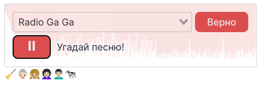

# emoji-music-captcha



Виджет отгадывания музыки по эмоджи знакам.

Этот веб-компонент на Vue был сделан в шутку, он не представляет собой боевой recaptcha виджет, т.к. у него нет 
блокировки, а это уже требуется реализация по бэку, к тому же нужно проводить исследования и отбор эмоджи строк 
(некоторые отгадать сложновато). Есть и другие проблемы у данного подхода, но в наше время любую капчу отгадать сложно, по крайней мере человеку. 

## Как юзать?

В dist компилируется готовый продукт в виде веб-компонентов, размещаем скрипты и ассеты из dist. Затем используем 
кастомные теги

```html
<emoji-music-recaptcha>Здесь будет код виджета</emoji-music-recaptcha>
<emoji-secret>Здесь будет эмоджи секрет</emoji-secret>
```

## События
- `captchaReload` - Перезапуск после неудачной попытки (обновление секрета)
- `captchaValidate` - Валидация с булевой переменной ошибки